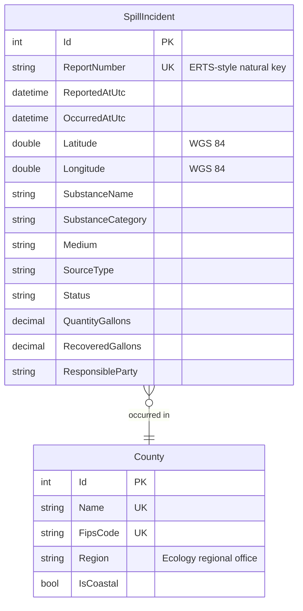

# SpillSense

[](https://github.com/jon-jc/spillsense/actions/workflows/ci.yml)


**Spill incident data management & analytics platform** — ASP.NET Core, Entity Framework Core, and Leaflet.

SpillSense models the data systems that support oil-spill prevention, preparedness, and response programs: structured incident records with spatial coordinates, a validated ETL intake pipeline, a filterable REST API, an interactive GIS dashboard, and reporting/export tooling for program analysts.

## Why this exists

Spill response programs live and die by data quality: a responder needs to know *what* spilled, *where*, *how much*, and *who is responsible* — fast. SpillSense demonstrates a full vertical slice of that problem:

- **Domain-driven data model** for spill incidents, aligned with how environmental agencies actually classify spills (medium affected, substance category, source type, response status, Ecology regional jurisdiction).
- **Reference geography** — all 39 Washington counties seeded with FIPS codes, Department of Ecology region assignments, and coastal flags, plus coordinate sanity bounds that catch swapped or malformed lat/lons at intake.
- **Database-enforced integrity** — unique natural keys for idempotent imports, restricted deletes on reference data, string-stored enums so the database stays self-describing for report writers, and indexes matched to dashboard query paths.

## Architecture

```
src/
  SpillSense.Domain/          Entities, enums, and geography rules. No dependencies.
  SpillSense.Infrastructure/  EF Core DbContext, configurations, migrations, ETL pipeline.
  SpillSense.Web/             ASP.NET Core host: REST API + the dashboard (wwwroot).
api/                          Serverless functions (Vercel) serving the same API contract
                              from a published data snapshot. See "Deploying" below.
tests/
  SpillSense.Tests/           .NET unit + integration tests (real migrations on SQLite).
tools/tests/                  node:test contract tests for the serverless API layer.
```

The default database provider is SQLite so the project runs anywhere with zero setup. The EF model is kept provider-portable — pointing the connection string at SQL Server is a drop-in swap, which mirrors a common agency deployment target.

## The dashboard

A dependency-light single-page GIS dashboard (vanilla ES modules, Leaflet, Chart.js — no build step) served at `/`:

- **Incident map** — clustered vector markers colored by substance category and sized by spill volume (log scale), with light/dark basemaps and a category legend.
- **Analytics** — animated KPI tiles (incidents, spilled/recovered gallons, georeferenced share), monthly trend, substance mix, and medium-affected charts, all driven by one validated color system (fixed hue-per-category, dark-mode steps chosen for the dark surface rather than auto-inverted).
- **Every filter drives every panel** — search, county, Ecology region, medium, substance, source, status, and date range combine with AND across the map, charts, KPIs, and table; active filters render as removable chips.
- **Shareable state** — filters live in the querystring, so any view is a permalink.
- **Incident explorer** — sortable, paged records table with inline volume bars and status pills; row click opens a detail drawer and flies the map to the incident.
- **Intake audit** — import runs with outcome chips; quarantined rows are reviewable with the raw CSV line and every validation failure.
- **Cared-for details** — full light/dark theming, keyboard access and focus management, `prefers-reduced-motion` support, skeleton loading states, and graceful error toasts.

### Data model



## Getting started

Requires the [.NET 10 SDK](https://dotnet.microsoft.com/download/dotnet/10.0).

```bash
dotnet test          # run the full suite
dotnet run --project src/SpillSense.Web
```

The web host applies migrations on startup and exposes `/healthz`.

### Loading data

The intake pipeline imports incident CSVs with full validation:

```bash
dotnet run --project src/SpillSense.Web -- import "$(pwd)/data/sample/spill_incidents_2020_2026.csv"
```

Every run is recorded as an auditable `ImportRun` with insert/update/unchanged/rejected counts. Imports are **idempotent** — re-running a file inserts nothing new, and changed rows update in place (matched on report number). Rows that fail validation are **quarantined** with the raw row preserved verbatim plus every failure reason, so nothing is silently dropped:

```bash
dotnet run --project src/SpillSense.Web -- import "$(pwd)/data/sample/quarantine_demo.csv"
# CompletedWithRejects: 10 rows - 3 inserted, 0 updated, 0 unchanged, 7 quarantined.
```

Validation catches malformed report numbers, unparseable or future dates, swapped/out-of-state coordinates, unknown counties, negative quantities, unrecognized classifications, and in-file duplicates — and reports *every* problem on a row at once. Free-text substance names are auto-classified into reporting categories (diesel, crude, heavy fuel oil, chemical, …).

> Sample data is synthetic (see `tools/generate-sample-data.mjs`) — realistic in shape and geography, but not real ERTS records.

### The API

Interactive API reference lives at **`/docs`** (OpenAPI document at `/openapi/v1.json`).

| Endpoint | Purpose |
|---|---|
| `GET /api/incidents` | Filterable, paged list — county, Ecology region, medium, substance category, source, status, date range, text search, `minGallons`, `bbox` spatial filter |
| `GET /api/incidents/{reportNumber}` | Full incident detail |
| `GET /api/incidents/geojson` | Same filters, returned as an RFC 7946 FeatureCollection for mapping |
| `GET /api/stats/summary` | Counts + volumes rolled up by medium, category, source, status |
| `GET /api/stats/trend` | Monthly incident counts and spilled volume |
| `GET /api/stats/counties` | Per-county rollup with FIPS codes |
| `GET /api/imports` | Import-run audit trail |
| `GET /api/imports/{id}/quarantine` | Quarantined rows with failure reasons |

All filters combine with AND and are shared across list, GeoJSON, and stats endpoints. Bad input returns RFC 9457 problem details naming every invalid parameter — e.g. `?medium=Lava` lists the accepted values.

## Deploying

**ASP.NET Core host (system of record).** `dotnet publish src/SpillSense.Web` and run behind your web server of choice; point `ConnectionStrings:SpillSense` at SQLite or SQL Server. This host owns the database, intake pipeline, and interactive API docs.

**Vercel (read-only replica).** The `api/` directory implements the same API contract as Node serverless functions, serving a published data snapshot (`api/_lib/data.json`) exported from the system of record:

```bash
node tools/export-vercel-data.mjs http://localhost:5178   # refresh the published snapshot
npx vercel deploy                                          # ship dashboard + API
```

The dashboard is host-agnostic — it calls the same endpoints either way, and `npm test` runs contract tests against the serverless layer so the two hosts can't drift apart.

## Roadmap

Built milestone by milestone via pull requests:

| Milestone | Scope | Status |
|---|---|---|
| M1 | Solution scaffold, domain model, EF Core persistence, CI | ✅ |
| M2 | ETL intake pipeline: validation, quarantine, idempotent upserts | ✅ |
| M3 | REST API: filtering, paging, stats, GeoJSON | ✅ |
| M4 | GIS dashboard: Leaflet map, charts, incident explorer; Vercel deployment | ✅ |
| M5 | Reporting: rollups, CSV export, documentation | ⏳ |

## License

MIT — see [LICENSE](LICENSE).
