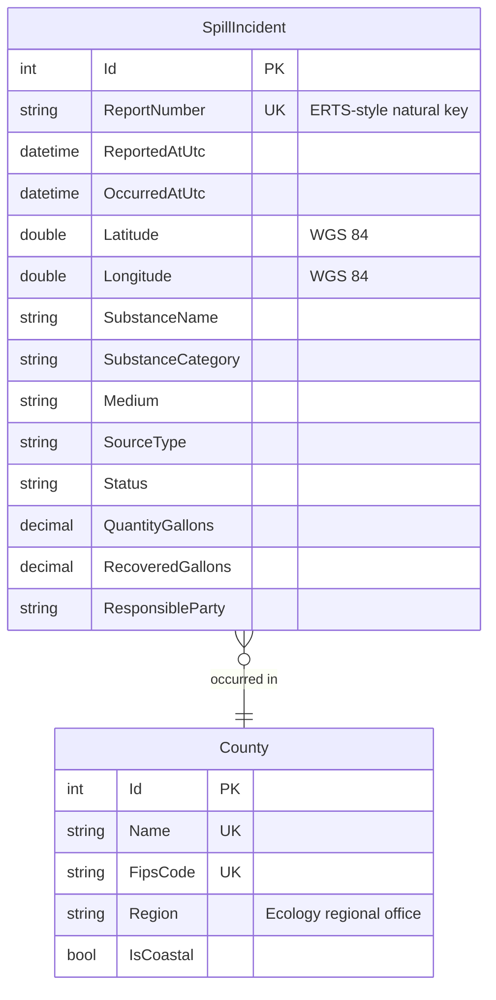

# SpillSense

[](https://github.com/jon-jc/spillsense/actions/workflows/ci.yml)


**Spill incident data management & analytics platform** — ASP.NET Core, Entity Framework Core, and Leaflet.

SpillSense models the data systems that support oil-spill prevention, preparedness, and response programs: structured incident records with spatial coordinates, a validated ETL intake pipeline, a filterable REST API, an interactive GIS dashboard, and reporting/export tooling for program analysts.

## Why this exists

Spill response programs live and die by data quality: a responder needs to know *what* spilled, *where*, *how much*, and *who is responsible* — fast. SpillSense demonstrates a full vertical slice of that problem:

- **Domain-driven data model** for spill incidents, aligned with how environmental agencies actually classify spills (medium affected, substance category, source type, response status, Ecology regional jurisdiction).
- **Reference geography** — all 39 Washington counties seeded with FIPS codes, Department of Ecology region assignments, and coastal flags, plus coordinate sanity bounds that catch swapped or malformed lat/lons at intake.
- **Database-enforced integrity** — unique natural keys for idempotent imports, restricted deletes on reference data, string-stored enums so the database stays self-describing for report writers, and indexes matched to dashboard query paths.

## Architecture

```
src/
  SpillSense.Domain/          Entities, enums, and geography rules. No dependencies.
  SpillSense.Infrastructure/  EF Core DbContext, configurations, migrations, seed data.
  SpillSense.Web/             ASP.NET Core host: API endpoints + dashboard (coming).
tests/
  SpillSense.Tests/           Unit + integration tests (in-memory SQLite runs real migrations).
```

The default database provider is SQLite so the project runs anywhere with zero setup. The EF model is kept provider-portable — pointing the connection string at SQL Server is a drop-in swap, which mirrors a common agency deployment target.

### Data model



## Getting started

Requires the [.NET 10 SDK](https://dotnet.microsoft.com/download/dotnet/10.0).

```bash
dotnet test          # run the full suite
dotnet run --project src/SpillSense.Web
```

The web host applies migrations on startup and exposes `/healthz`.

### Loading data

The intake pipeline imports incident CSVs with full validation:

```bash
dotnet run --project src/SpillSense.Web -- import "$(pwd)/data/sample/spill_incidents_2020_2026.csv"
```

Every run is recorded as an auditable `ImportRun` with insert/update/unchanged/rejected counts. Imports are **idempotent** — re-running a file inserts nothing new, and changed rows update in place (matched on report number). Rows that fail validation are **quarantined** with the raw row preserved verbatim plus every failure reason, so nothing is silently dropped:

```bash
dotnet run --project src/SpillSense.Web -- import "$(pwd)/data/sample/quarantine_demo.csv"
# CompletedWithRejects: 10 rows - 3 inserted, 0 updated, 0 unchanged, 7 quarantined.
```

Validation catches malformed report numbers, unparseable or future dates, swapped/out-of-state coordinates, unknown counties, negative quantities, unrecognized classifications, and in-file duplicates — and reports *every* problem on a row at once. Free-text substance names are auto-classified into reporting categories (diesel, crude, heavy fuel oil, chemical, …).

> Sample data is synthetic (see `tools/generate-sample-data.mjs`) — realistic in shape and geography, but not real ERTS records.

## Roadmap

Built milestone by milestone via pull requests:

| Milestone | Scope | Status |
|---|---|---|
| M1 | Solution scaffold, domain model, EF Core persistence, CI | ✅ |
| M2 | ETL intake pipeline: validation, quarantine, idempotent upserts | ✅ |
| M3 | REST API: filtering, paging, stats, GeoJSON | ⏳ |
| M4 | GIS dashboard: Leaflet map, charts, incident explorer | ⏳ |
| M5 | Reporting: rollups, CSV export, documentation | ⏳ |

## License

MIT — see [LICENSE](LICENSE).
