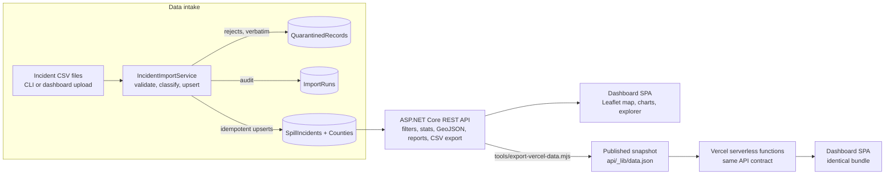
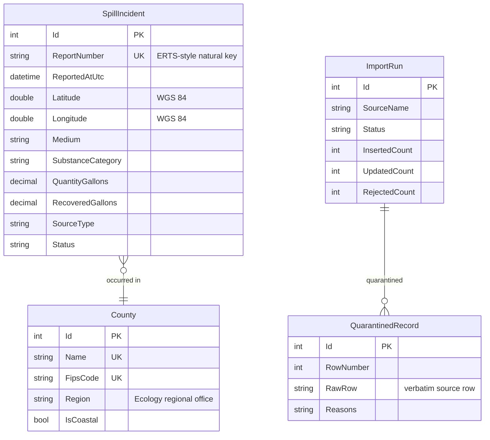

# SpillSense — Architecture & Decisions

This document explains how the system fits together and why the load-bearing
choices were made.

## System overview

Two hosts, one contract: the ASP.NET Core application is the **system of
record** (database, intake, migrations, interactive docs); the Vercel
deployment is a **read-only replica** serving a published snapshot through
byte-compatible endpoints. The dashboard bundle is identical on both and
detects host-only capabilities (the `/docs` reference) with a probe rather
than build flags.

## Data model

## Decisions

**SQLite by default, SQL Server by design.**
The EF Core model avoids provider-specific features, stores enums as strings,
and routes decimal aggregation through `double` (the one SQLite-driven
concession, isolated to query code). A SQL Server connection string is a
drop-in swap; the zero-setup default keeps `git clone && dotnet test` honest.

**Natural key for imports.**
`ReportNumber` is unique at the database level and is the upsert key. Imports
are therefore idempotent by construction: re-running a file cannot duplicate
incidents, and "changed / unchanged / new" is decidable per row.

**Quarantine over rejection.**
Bad rows are never silently dropped and never block good rows. The raw source
row is preserved verbatim with *every* validation failure (not just the
first), tied to an auditable run — the workflow a data steward actually needs
to fix and resubmit records.

**Validation collects, then reports.**
Both the ETL validator and the API query parser accumulate all problems and
return them together, with accepted values named in the message. One
round-trip to fix a row or a request, not five.

**Enums stored as strings.**
The database stays self-describing for report writers and DBAs querying
outside the application — a deliberate trade of a few bytes for operational
legibility, in line with reporting-heavy program environments.

**Coordinate sanity at the boundary.**
Statewide WGS 84 bounds catch the classic field-data failure modes (swapped
lat/lon, missing negative sign on longitude) at intake, with corrective
guidance in the error message, so the map never renders a Washington spill in
Mongolia.

**Snapshot replication, not logic duplication, for the serverless host.**
The Vercel functions re-implement only the thin query/aggregation layer over
data exported from the system of record — never intake or validation. A
node:test contract suite runs in CI beside the .NET integration suite, so the
two hosts cannot silently drift on the shared contract.

**One intake path, two entry points.**
The CLI (`dotnet run -- import file.csv`) and the dashboard upload
(`POST /api/imports`) both call the same `IncidentImportService`, so validation,
quarantine, and idempotency behave identically no matter who starts the run.
The read-only replica answers `POST /api/imports` with `405` and an explanation
rather than silently accepting data it cannot persist — a wrong success is worse
than an honest refusal.

**No frontend build step.**
The dashboard is vanilla ES modules with vendored, version-pinned libraries.
It loads fast, works offline, deploys as plain static files on both hosts, and
carries zero toolchain risk — appropriate for a small program team maintaining
a system for years.

**Fixed-hue color system.**
Substance categories own their hues (map markers, donut, legend all agree),
dark mode uses re-stepped values validated against the dark surface rather
than automatic inversion, and identity is never carried by color alone.

## Testing strategy

| Layer | Approach |
|---|---|
| Domain rules | Plain xUnit unit tests |
| Schema & constraints | Tests run the **real migrations** on in-memory SQLite and assert database-enforced behavior (unique keys, seeds, string enums) |
| ETL | Behavioral tests incl. end-to-end imports of both committed sample files with exact counts |
| REST API | `WebApplicationFactory` integration tests against a migrated, seeded database — filter matrix, error surface, GeoJSON shape, stats math |
| Serverless API | `node:test` contract tests invoking the deployed handlers directly |
| CI | Both suites on every push/PR; warnings-as-errors with NuGet vulnerability audit |
